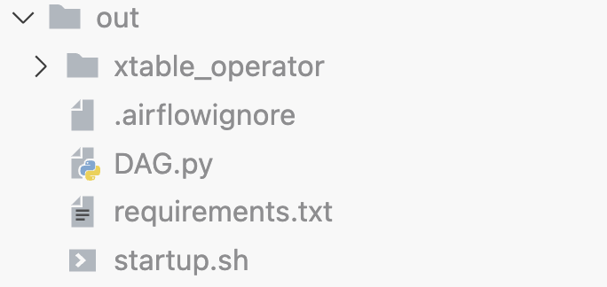
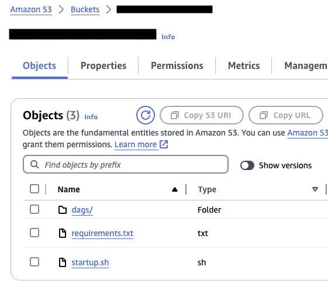
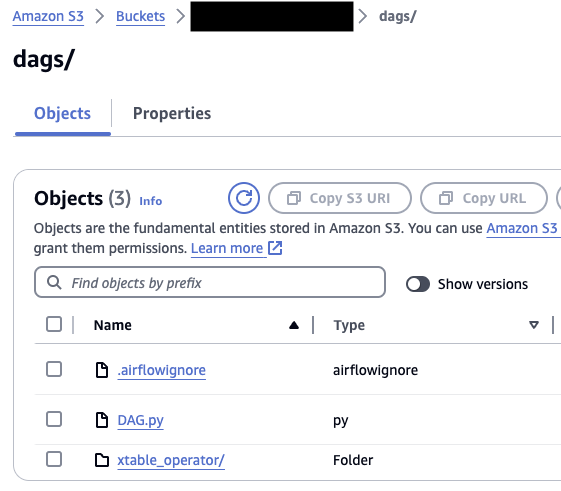
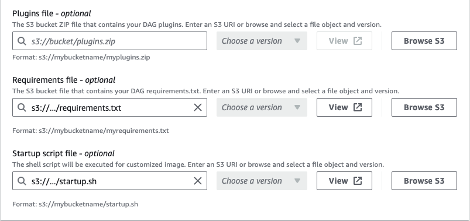

# `apache-xtable-on-aws-samples`

- [`apache-xtable-on-aws-samples`](#apache-xtable-on-aws-samples)
  - [Amazon MWAA Operator](#amazon-mwaa-operator)
    - [Prerequisites - Amazon MWAA Operator](#prerequisites---amazon-mwaa-operator)
    - [Step-by-step-guide - Amazon MWAA Operator](#step-by-step-guide---amazon-mwaa-operator)
    - [\[Optional step: AWS Glue Data Catalog used as an Iceberg Catalog\]](#optional-step-aws-glue-data-catalog-used-as-an-iceberg-catalog)
    - [Clean Up](#clean-up)
  - [Security](#security)
  - [Code of Conduct](#code-of-conduct)
  - [License](#license)

Open table formats (OTFs) like Apache Iceberg are being increasingly adopted, for example, to improve transactional consistency of a data lake or to consolidate batch and streaming data pipelines on a single file format and reduce complexity. In practice, architects need to integrate the chosen format with the various layers of a modern data platform. However, the level of support for the different OTFs varies across common analytical services.

Commercial vendors and the open source community have recognized this situation and are working on interoperability between table formats. One approach is to make a single physical dataset readable in different formats by translating its metadata and avoiding reprocessing of actual data files. Apache XTable is an open source solution that follows this approach and provides abstractions and tools for the translation of open table format metadata.

In this repository, we show how to get started with Apache XTable on AWS. This repository is meant to be used in combination with related blog posts on this topic:

- [Blog - Run Apache XTable on Amazon MWAA to translate open table formats](TODO)

## Amazon MWAA Operator

To deploy the custom operator to Amazon MWAA, we upload it together with DAGs into the configured DAG folder. Besides the operator itself, we also need to upload XTable’s executable JAR. As of writing this post, the JAR needs to be compiled by the user from source code. To simplify this, we provide a container-based build script.

### Prerequisites - Amazon MWAA Operator

We assume you have at least an environment consisting of Amazon MWAA itself, an S3 bucket, and an [AWS Identity and Access Management](https://aws.amazon.com/iam/) (IAM) role for Amazon MWAA that has read access to the bucket and optionally write access to the AWS Glue Data Catalog. In addition, you need one of the following container runtimes to run the provided build script for XTable:

- [Finch](https://runfinch.com/docs/getting-started/installation/)
- [Docker](https://docs.docker.com/get-docker/)

### Step-by-step-guide - Amazon MWAA Operator

To compile XTable, you can use the provided build script and complete the following steps:

(1) Clone the sample code from GitHub:

``` bash
git clone git@github.com:aws-samples/apache-xtable-on-aws-samples.git
cd ./apache-xtable-on-aws-samples/xtable_operator
```

(2) Run the build script:

```bash
./build-airflow-operator.sh
```



(3) Because the Airflow operator uses the library [JPype](https://github.com/jpype-project/jpype) to invoke XTable’s JAR, add a dependency in the Amazon MWAA requirement.txt file:

``` python
# requirements.txt
JPype1==1.5.0
```

For a background on installing additional Python libraries on Amazon MWAA, see [Installing Python dependencies](https://docs.aws.amazon.com/mwaa/latest/userguide/working-dags-dependencies.html).

(4) Because XTable is Java-based, a Java 11 runtime environment (JRE) is required on Amazon MWAA. You can use Amazon MWAA’s startup script, to install a JRE. Add the following lines to an existing startup script or create a new one as provided in the sample code base of this post:

``` bash
# startup.sh
if [[ "${MWAA_AIRFLOW_COMPONENT}" != "webserver" ]]
then
    sudo yum install -y java-11-amazon-corretto-headless
fi
```

For more information about this mechanism, see [Using a startup script with Amazon MWAA](https://docs.aws.amazon.com/mwaa/latest/userguide/using-startup-script.html).

(5) Upload *xtable_operator/*, *requirements.txt*, *startup.sh* and *.airflowignore* to the S3 bucket and respective paths from which Amazon MWAA will read files. Make sure the IAM role for Amazon MWAA has appropriate read permissions.

With regard to the Customer Operator, make sure to upload the local folder *xtable_operator/* into the configured DAG folder along with the [*.airflowignore*](https://airflow.apache.org/docs/apache-airflow/stable/core-concepts/dags.html#airflowignore) file.

<p align="center" float="left">
    
    
</p>

(6) Update the configuration of your Amazon MWAA environment as follows and start the update process:

- Add or update the S3 URI to the *requirements.txt* file through the Requirements file configuration option.
- Add or update the S3 URI to the *startup.sh* script through the Startup script configuration option.

<p align="center">
    
</p>

### [Optional step: AWS Glue Data Catalog used as an Iceberg Catalog]

Optionally, you can use the AWS Glue Data Catalog as an Iceberg catalog.

(7) In case you create Iceberg metadata and want to register it in the AWS Glue Data Catalog, the Amazon MWAA role needs permissions to create or modify tables in AWS Glue. The following listing shows a minimal policy for this. It constrains permissions to a defined database in AWS Glue:

``` json
{
    "Version": "2012-10-17",
    "Statement": [
        {
            "Effect": "Allow",
            "Action": [
                "glue:GetDatabase",
                "glue:CreateTable",
                "glue:GetTables",
                "glue:UpdateTable",
                "glue:GetDatabases",
                "glue:GetTable"
            ],
            "Resource": [
                "arn:aws:glue:<AWS Region>:<AWS Account ID>:catalog",
                "arn:aws:glue:<AWS Region>:<AWS Account ID>:database/<Database name>",
                "arn:aws:glue:<AWS Region>:<AWS Account ID>:table/<Database name>/*"
            ]
        }
    ]
}
```

### Clean Up

- Delete the downloaded git repository:

```bash
  rm -r apache-xtable-on-aws-samples
```

- Delete the used docker image:

```bash
  docker image rm public.ecr.aws/amazonlinux/amazonlinux:2023.4.20240319.1
```

- Reverse Amazon MWAA configurations in:
  - requirements.txt
  - startup.sh
  - DAG
  - MWAA execution role

- Delete files or versions of files in your S3 Bucket:
  - requirements.txt
  - startup.sh
  - DAG
  - .airflowignore

## Security

See [CONTRIBUTING](./CONTRIBUTING.md#security-issue-notifications) for more information.

## Code of Conduct

See [CODE OF CONDUCT](./CODE_OF_CONDUCT.md) for more information.

## License

This library is licensed under the MIT-0 License. See the [LICENSE](./LICENSE) file.
